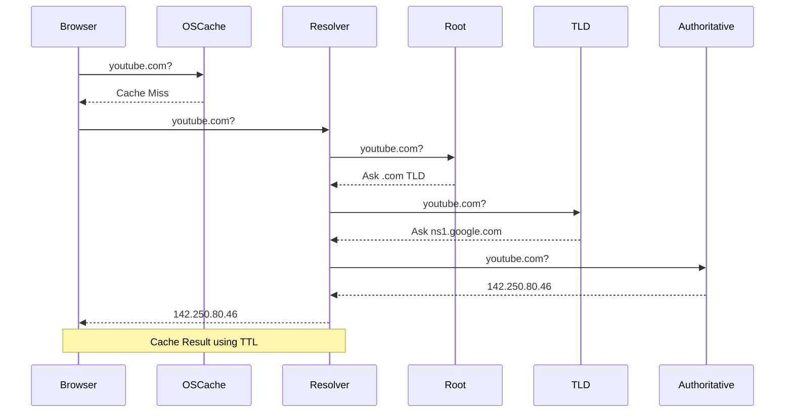

# Chapter 3: DNS (Domain Name System)

## Why This Chapter Matters

Before a client can communicate with a server, it must know where that server is located.

Humans use names:

```text
youtube.com
instagram.com
amazon.com
```

Computers use IP addresses:

```text
142.250.80.46
157.240.1.174
205.251.242.103
```

DNS bridges this gap.

---

# 📘 What is DNS?

DNS (Domain Name System) translates human-readable domain names into IP addresses.

## Analogy

Think of DNS as the internet's phonebook.

```text
Name          -> Phone Number
youtube.com   -> 142.250.80.46
```

---

# Why Not Use IP Addresses Directly?

| Reason | Explanation |
|----------|----------|
| Human Readability | Easier to remember |
| IPs Change | Infrastructure evolves |
| Multiple Servers | One domain can map to many servers |
| Traffic Routing | Users can be routed geographically |

---

# DNS Record Types

| Record | Purpose | Example |
|----------|----------|----------|
| A | Domain → IPv4 | youtube.com → 142.250.80.46 |
| AAAA | Domain → IPv6 | youtube.com → IPv6 |
| CNAME | Alias | www.youtube.com → youtube.com |
| MX | Mail Server | Gmail routing |
| NS | Name Server | ns1.google.com |

---

# DNS Resolution Flow



---

# Resolution Steps

1. Browser cache lookup
2. OS cache lookup
3. ISP Recursive Resolver
4. Root Name Server
5. TLD Name Server
6. Authoritative Name Server
7. Cache Result

---

# Recursive vs Iterative Resolution

## Recursive

```text
Client asks resolver.
Resolver does all work.
Resolver returns answer.
```

## Iterative

```text
Root -> TLD -> Authoritative
Each server points to the next server.
```

Interviewers frequently ask this distinction.

---

# DNS Caching

Caching reduces latency and DNS load.

Caches exist at:

- Browser
- Operating System
- ISP Resolver

---

# TTL (Time To Live)

Example:

```text
TTL = 300 seconds
```

Meaning:

```text
DNS answer can be cached for 5 minutes.
```

## TTL Tradeoff

Low TTL:

- Faster failover
- More DNS traffic

High TTL:

- Less DNS traffic
- Slower failover

---

# 🏗 DNS in System Design

## 1. Global Load Balancing (GeoDNS)

```text
India User  -> Mumbai DC
US User     -> Iowa DC
Europe User -> Belgium DC
```

Same domain.

Different IPs.

---

## 2. Failover

```text
Primary  -> Healthy
Backup   -> Standby
```

When primary fails:

```text
youtube.com
    ↓
Backup Server
```

---

## 3. CDN Integration

```text
youtube.com
    ↓
cdn.youtube.com
    ↓
Nearest Edge Server
```

DNS is often the first layer of CDN routing.

---

# 🌍 Real World Example: YouTube

When a user in India opens YouTube:

```text
youtube.com
    ↓
DNS
    ↓
Mumbai Edge Location
    ↓
Nearest CDN Node
```

This reduces latency and improves startup time.

---

# ⚠ Common Misconception

DNS is NOT real-time.

Because of caching:

```text
DNS Change
    ≠
Instant User Update
```

Propagation depends on TTL.

---

# 🎯 Interview Questions

## Why can't we use DNS instead of a Load Balancer?

DNS:
- Routes before connection

Load Balancer:
- Routes every request

They solve different problems.

---

## Why is low TTL not always better?

Because it increases:

- DNS traffic
- Resolver load
- Cost

---

## What happens if DNS provider fails?

Entire application can become unreachable even when servers are healthy.

---

# Architect Perspective

DNS is not just name resolution.

It is often the:

- First routing layer
- First failover layer
- First geo-distribution layer

before traffic reaches your infrastructure.

---

# 📝 Revision Notes

Remember:

```text
DNS = Name -> IP

Caching reduces latency.

TTL controls cache duration.

DNS enables:
- Geo Routing
- Failover
- CDN Routing
```

System Design Insight:

DNS is the first component involved in routing a request across the internet.
