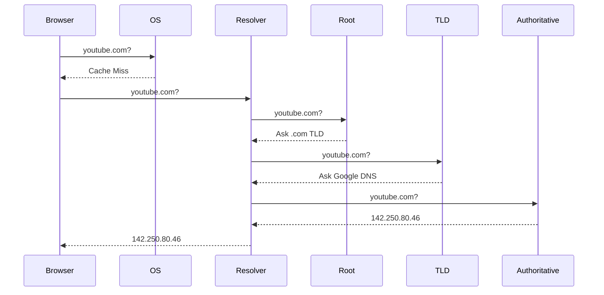

# Chapter 3: DNS (Domain Name System)

## Why DNS Exists

Let's start with a simple question.

Imagine I ask you to open YouTube.

You type:

```text
youtube.com
```

into your browser.

Now think about this:

How does your laptop know where YouTube is located?

Your laptop doesn't understand:

```text
youtube.com
```

Computers communicate using IP addresses.

Example:

```text
142.250.80.46
```

For a computer, an IP address is like a home address.

If the computer doesn't know the destination address, it cannot send the request.

So before opening YouTube, the browser must answer:

> What is the IP address of youtube.com?

DNS exists to solve exactly this problem.

---

## The Problem DNS Solves

Imagine the internet without DNS.

Instead of:

```text
youtube.com
google.com
amazon.com
```

you would have to remember:

```text
142.250.80.46
172.217.160.110
205.251.242.103
```

This would be impossible at internet scale.

DNS provides a human-friendly naming layer.

```text
Human Language
        ↓
youtube.com

DNS Translation
        ↓

Machine Language
        ↓

142.250.80.46
```

Think of DNS as the internet's phonebook.

You know the person's name.

You don't know their phone number.

DNS gives you the number.

---

# Why Not Use IP Addresses Directly?

Many beginners ask:

> If computers need IP addresses, why don't we simply use IP addresses?

Excellent question.

There are several reasons.

## Reason 1: Human Readability

Which is easier?

```text
youtube.com
```

or

```text
142.250.80.46
```

Obviously the domain name.

Humans remember names.

Machines remember numbers.

---

## Reason 2: IP Addresses Change

Suppose YouTube moves its servers.

Today:

```text
youtube.com
        ↓
142.250.80.46
```

Tomorrow:

```text
youtube.com
        ↓
34.110.250.10
```

Users continue using:

```text
youtube.com
```

No changes required.

DNS absorbs infrastructure changes.

---

## Reason 3: One Domain Can Have Many IPs

Most people think:

```text
youtube.com
        ↓
1 IP
```

Wrong.

In reality:

```text
youtube.com
        ↓
IP-1

youtube.com
        ↓
IP-2

youtube.com
        ↓
IP-3
```

DNS can return different IPs.

This helps distribute traffic.

---

## Reason 4: Geographic Routing

A user in India should not always go to a server in the USA.

That would increase latency.

Instead:

```text
India User
       ↓
Mumbai Server

US User
       ↓
Iowa Server

Europe User
       ↓
Belgium Server
```

DNS can return different answers depending on the user's location.

This concept is called:

```text
GeoDNS
```

We'll revisit it later.

---

# DNS Architecture

Most people think DNS is a single server.

It's not.

DNS is a massive distributed system.

A lookup travels through multiple layers.

```text
Browser
    ↓
OS Cache
    ↓
Recursive Resolver
    ↓
Root Server
    ↓
TLD Server
    ↓
Authoritative Server
```

Every layer exists for a reason.

Let's understand each one.

---

# Step 1: Browser Cache

Imagine you open:

```text
youtube.com
```

The browser asks:

> Do I already know the IP address?

Modern browsers maintain an internal DNS cache.

Example:

```text
youtube.com
    ↓
142.250.80.46
```

If found:

```text
Cache Hit
```

No network request needed.

If not found:

```text
Cache Miss
```

Move to next step.

## Why Browser Cache Exists

Network calls are expensive.

Typical timings:

```text
Memory Lookup
≈ Microseconds

DNS Network Lookup
≈ 20–100 ms
```

Cache is thousands of times faster.

This is the first lesson in system design:

> Always check cache before going to the network.

You'll see this pattern repeatedly.

---

# Step 2: OS Cache

Suppose browser cache misses.

Browser asks the Operating System.

Examples:

### Windows

```text
DNS Client Service
```

### Linux

```text
systemd-resolved
```

### macOS

```text
mDNSResponder
```

The OS also maintains a DNS cache.

Why?

Because multiple applications may need the same DNS record.

Example:

```text
Chrome
Slack
VS Code
Teams
```

All might access:

```text
api.company.com
```

The OS cache prevents duplicate lookups.

---

# Step 3: Recursive Resolver

Suppose OS cache also misses.

Now the request leaves your machine.

It reaches a:

```text
Recursive Resolver
```

Usually owned by:

- ISP
- Google DNS (8.8.8.8)
- Cloudflare DNS (1.1.1.1)

The resolver's job is:

> Find the answer on behalf of the client.

The browser says:

```text
Find youtube.com
```

The resolver says:

```text
Leave it to me.
I'll do all the work.
```

This is why it is called:

```text
Recursive Resolution
```

## Why Not Let Browsers Contact Root Servers Directly?

Imagine billions of devices contacting root servers.

Root servers would collapse.

Instead:

```text
Millions of Clients
          ↓
Few Recursive Resolvers
          ↓
DNS Infrastructure
```

This dramatically reduces load.

---

# Step 4: Root Name Servers

Now the resolver begins searching.

First stop:

```text
Root Server
```

Many people misunderstand root servers.

Root servers do NOT know YouTube's IP.

They only know:

```text
Where .com lives
Where .org lives
Where .net lives
Where .in lives
```

Think of root servers as a receptionist.

Example:

```text
Question:
Where is youtube.com?

Root:
I don't know.
But .com servers know.
Ask them.
```

---

# Why DNS Is Hierarchical

Imagine storing:

```text
All domains
All IPs
Entire Internet
```

inside one server.

Impossible.

DNS uses delegation.

```text
Root
 ↓
.com
 ↓
google.com
 ↓
youtube.com
```

Each layer knows only its responsibility.

This allows DNS to scale globally.

---

# Step 5: TLD Server

TLD means:

```text
Top Level Domain
```

Examples:

```text
.com
.org
.net
.in
.io
```

The resolver asks:

```text
Where is youtube.com?
```

TLD replies:

```text
I don't know the IP.

But Google's DNS servers know.

Ask them.
```

---

# Step 6: Authoritative DNS Server

Now the resolver reaches the final source of truth.

```text
Google Authoritative DNS
```

This server owns the record.

Example:

```text
youtube.com
       ↓
142.250.80.46
```

Unlike caches:

```text
Browser Cache
OS Cache
Resolver Cache
```

the authoritative server contains the actual DNS record.

This is where the answer finally comes from.

---

# Complete DNS Resolution Flow



## What Is Happening Here?

1. Browser checks cache.
2. OS checks cache.
3. Resolver takes responsibility for finding the answer.
4. Root server directs resolver to the correct TLD.
5. TLD directs resolver to the authoritative server.
6. Authoritative server returns the actual IP.
7. Resolver caches the answer.
8. Browser receives the IP address.

Only now can the browser start connecting to YouTube.

---

# DNS Record Types

| Record Type | Purpose | Example |
|------------|----------|----------|
| A | Domain → IPv4 | youtube.com → 142.250.80.46 |
| AAAA | Domain → IPv6 | youtube.com → IPv6 Address |
| CNAME | Alias | www.youtube.com → youtube.com |
| MX | Mail Routing | gmail.com mail servers |
| NS | Name Servers | ns1.google.com |

---

# DNS Caching

After the resolver gets the answer:

```text
142.250.80.46
```

it stores it.

Why?

Because another user might ask the same question.

Without caching:

```text
Every lookup
→ Root
→ TLD
→ Authoritative
```

This would overload DNS infrastructure.

Caching dramatically reduces traffic.

---

# TTL (Time To Live)

Every DNS record has:

```text
TTL
```

Example:

```text
300 seconds
```

Meaning:

```text
Cache answer for 5 minutes
```

After expiration:

```text
Lookup again
```

## TTL Tradeoff

### Low TTL

```text
60 seconds
```

Pros:

- Faster failover
- Faster updates

Cons:

- More DNS traffic

### High TTL

```text
3600 seconds
```

Pros:

- Less DNS traffic

Cons:

- Slower failover

---

# DNS in System Design

Now we move beyond networking.

This is where architects care.

## GeoDNS

Users should reach the nearest data center.

```text
India User
      ↓
Mumbai

US User
      ↓
Iowa

Europe User
      ↓
Belgium
```

Same domain.

Different answers.

---

## Failover

Primary:

```text
10.0.1.100
```

Backup:

```text
10.0.2.100
```

Normal:

```text
youtube.com
      ↓
Primary
```

Failure:

```text
youtube.com
      ↓
Backup
```

DNS becomes the first layer of disaster recovery.

---

## CDN Integration

This is how YouTube and Netflix scale.

Instead of:

```text
User
 ↓
Origin Server
```

they do:

```text
User
 ↓
CDN Edge
 ↓
Origin Server
```

DNS routes users to the nearest CDN edge.

---

# Real World Example: YouTube

When a user in Hyderabad opens YouTube:

```text
youtube.com
       ↓
DNS Lookup
       ↓
Nearest Edge Location
       ↓
CDN
       ↓
Video Starts
```

Without DNS-based routing:

```text
India User
      ↓
US Server
```

Latency would be much higher.

---

# Common Misconception

Many engineers think:

```text
DNS Change
=
Instant Update
```

Wrong.

Because of caching:

```text
DNS Change
≠
Instant Propagation
```

TTL controls propagation speed.

---

# Interview Questions

## Why Can't DNS Replace a Load Balancer?

DNS routing:

```text
Once per lookup
```

Load Balancer:

```text
Every request
```

Different responsibilities.

---

## Why Is DNS Hierarchical?

To scale to billions of domains.

---

## Why Is Caching Critical in DNS?

To reduce latency and infrastructure load.

---

# Architect Perspective

Most engineers think:

```text
DNS = Name Resolution
```

Architects think:

```text
DNS =
Routing Layer
Failover Layer
Geo Distribution Layer
CDN Entry Point
```

Before a request reaches your infrastructure, DNS has already influenced:

- Where traffic goes
- Which region serves the request
- Which CDN node responds
- How failover occurs

That is why DNS is far more important than most engineers realize.

---

# Revision Notes

Remember these four statements:

```text
DNS converts names into IP addresses.

DNS is hierarchical.

Caching makes DNS scalable.

DNS is the first layer of traffic routing.
```

For Principal Engineer interviews, always connect DNS to:

```text
Global Routing
GeoDNS
Failover
CDN Integration
Latency Optimization
```

because that is where DNS becomes a system design topic rather than just a networking topic.
